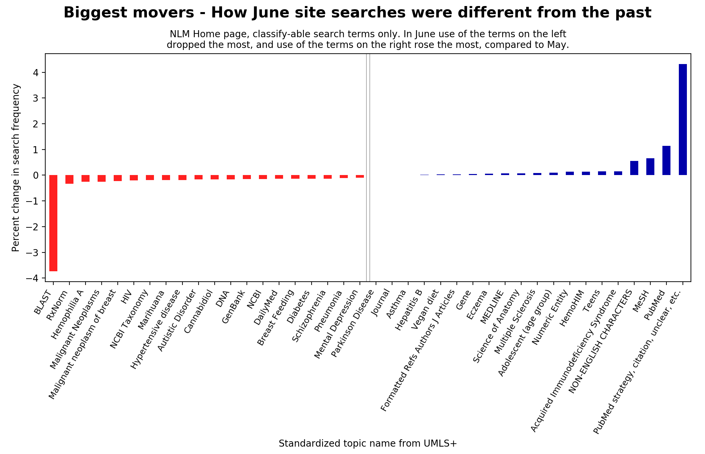
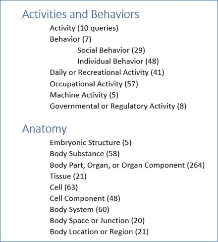
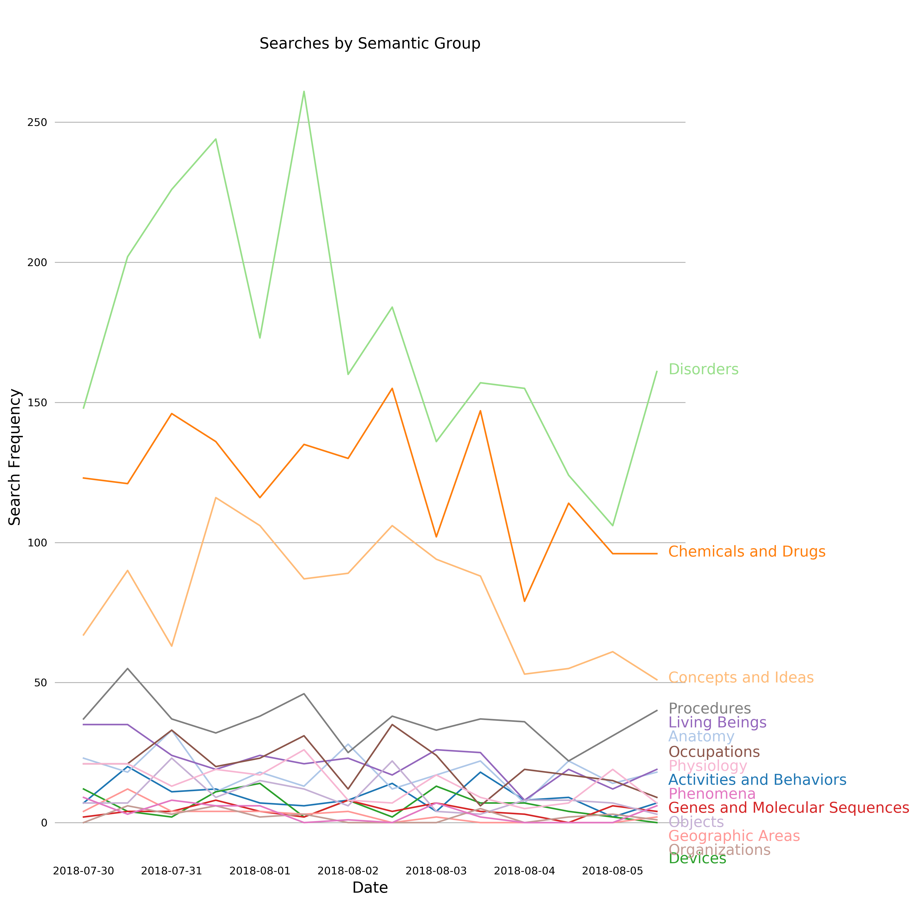
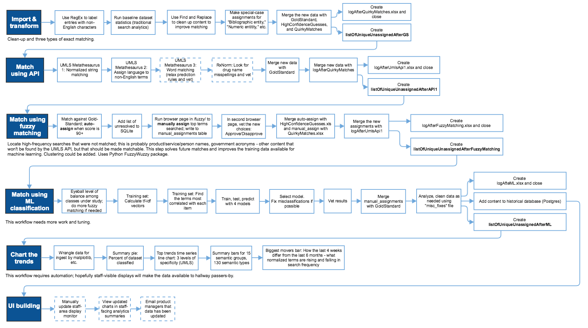

# Semantic Search Log Analysis Pipeline (SSLAP)

> **Classify web visitor queries so you can chart, and respond to, trends in information seeking**

The logs for internal search for large biomedical web sites can be too verbose and too inharmonious to make sense of. Logs for one NIH site contains more than 200,000 queries per month, with many variations on the same conceptual ideas. Aggregating log entries such as "ObamaCare" and "ACA" and "Affordable Care Act," for example, is far too difficult for a human to parse and take action on. This leads to several missed opportunities in web communication management.

Product managers and others COULD BE using this data to understand the information marketplace and understand how to serve their customers better. But without automation, the amount of human effort required has not been worth the return on the investment. If there were a way to automatically unite queries that are similar but not the same, under broader topics that could be effectively aggregated and compared over time, then we could more easily explore patterns in the vast amount of data generated, and begin to interpret their meaning.

## Goals/Scope 

Four benefits of analyzing site search - we will be able to:

1. **Cluster and analyze trends that we know about.** For multi-faceted topics that directly relate to our mission, we could create customized analyses using Python to collect the disparate keywords people might search for, into a single "bucket." Where in the site is there interest in various facets of this subject? Analyzing a trend can show us new constellations of resources that we may not be treating as related. If we were to select a constellation topic such as "opioids" as a topic of study, our bucket might include terms around Fentanyl, heroin, drug treatment, overdose, emergency medicine, etc.), and we could then look at where this person should be in our site, and change the site to help them get there.
2. **Focus staff work onto new trends, as the trends emerge.** When something new starts to happen that can be matched to our mission statement, we can start new content projects to address the emerging need.
3. **Improve our search interface.** This analysis might help us locate terms that need to be added to the search autocomplete. Or, it could help us improve the search results interface.
4. **Locate and fix site areas where there is a communications mismatch.** When we don’t provide the information that customers had expected, as evidenced by an outsized number of people searching for things that aren't near to the page where they were searching from, we should change the visibility of that content. We could move its search engine optimization (SEO) profile upward or downward as appropriate. This might involve updating the top navigation, the page-level sub-navigation, the page metadata, various content labeling such as headings, or by updating the subject content of the page(s). In some cases retirement of the content might be the appropriate response. Lastly, as recommended by usability and plain language expert Ginny Redish, we should put our site customers' words into our page headings. "The headings in your web content must resonate with your site customers."

## Reporting at three levels of specificity / granularity

This project standardizes multiple customer versions of a search concept into one concept that can be accurately aggregated.

The [Unified Medical Language System (UMLS)](https://www.nlm.nih.gov/research/umls/quickstart.html) API offers a **preferred term** for what site visitors typed, when possible.  We also include "fuzzy matching" against data from a web site spidering, because many product and service names, proper names, and other entities are not covered by UMLS. Here, a before-and-after study of how search behavior changed after a home page redesign. 

Given a preferred term, the UMLS API can provide one or two (perhaps more) broader grouping categories called [**Semantic Types,**](https://www.nlm.nih.gov/research/umls/META3_current_semantic_types.html), of which there are around 130. (This hierachical report is still under revision.)

At the broadest level, there are 15 **Semantic Groups** that cover all of health-medicine and much of the life sciences, in mutually exclusive categories. Here: small sample dataset of only 7 days.

## Workflow

Whole-project view. We do not have a deployable software package at this time; this repo contains scripts that can be run together or separately.

9/13/2018: Incomplete or not-started elements have a dotted border.

## Future Directions

1. Collapse SPECIALIST LEXICON into a dictionary to be ingested by Hunspell to create better spellchecking to match with search terms
2. Cluster by web page text body instead of just the headings and metadata currently used. (tf-idf) This might involve switching to the BeautifulSoup tool, and using tf-idf vectorization; we could create a word bank for each topic.
3. Other NLP Toolset Integrations: 
  + Google's search algorithm has a very good suggestion system backed by billions of search queries to correct for misspellings - using an available API; so we were not reinventing the wheel.
  + Stanford has a toolset for named entity extraction, that could be used for better collection of web page data.
4. R&D whether to start pulling down relationships to assist with some currently unresolvable queries; https://www.nlm.nih.gov/research/umls/META3_current_relations.html.
5. Post draft of business plan document, perhaps a Business Model Canvas.
6. Consider capturing IDs for preferred terms for later use? So people can use wikidata, SPARQL, etc. connections?
7. Re-build the GoldStandard file (successful and vetted past matches) and post it for use by other web site teams.
